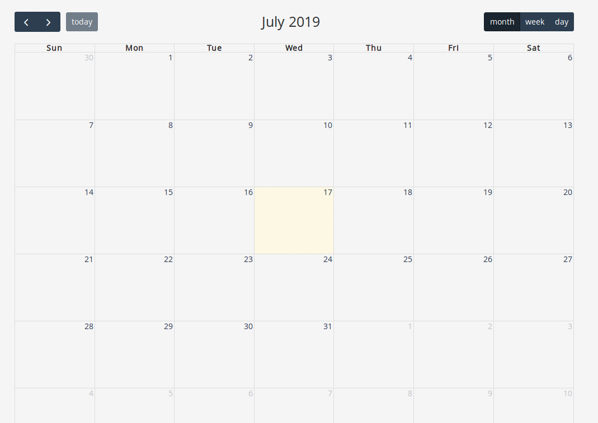

# Full Page Calendar
A full-sized add, edit, delete and drag/drop JavaScript event calendar.

## Version history
 - fullcalendar-4.2.0
 <br/><br/>
 ## Demo
 


<br/><br/>
## Usage
 - Step 1: Add fullpage calendar required js and css files, we have total package of fullpage calendar. You can include files from there.
 - Step 2: Create a view file for reference you can check **full_calendar.html.erb** in root directory.
 - Step 3: We need to add a div element in html:<br/>
 
 ```html
    <div id="calendar"></div>	
 ```
 - Step 4: Apply JS code to div element we have added in setp 3. For refrence you can check **full_calendar.html.erb**. For Add, Update and Delete an event you can look for ajax code.
 
 
 
